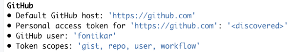
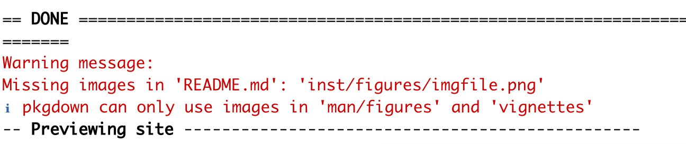
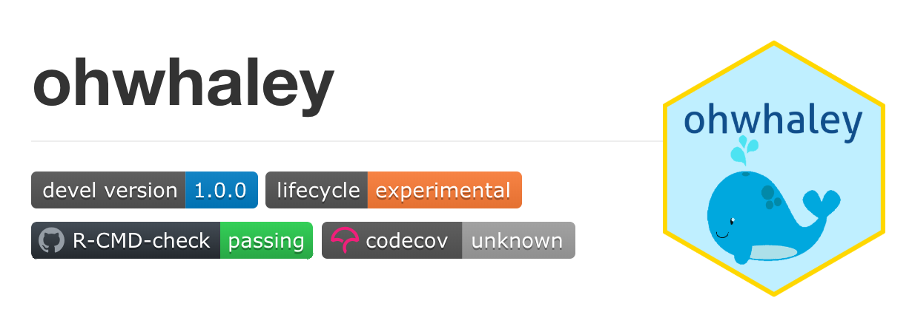

```{r BTS, include=FALSE}
knitr::opts_chunk$set(echo = TRUE,
                      warning = FALSE,
                      message = FALSE,
                      error = FALSE, 
                      eval = FALSE)

pacman::p_load(dplyr)
```


```{r klippy, eval=TRUE, echo=FALSE, include=TRUE}
klippy::klippy(position = c('top', 'right'))
```

In this part of the workshop, we will learn to create and customise a **webpage using `{pkgdown}`** for your R package 📦! We will also implement a GitHub Action to continuous integrate and deploy the website via [GitHub pages](https://pages.github.com/)

We will be using some very handy R tools today! Massive shout out to the contributors and maintainers for of [{usethis}](https://github.com/r-lib/usethis), [{pkgdown}](https://github.com/r-lib/pkgdown) and [r-lib/actions](https://github.com/r-lib/actions/graphs/contributors) for making our lives easier! 👏👏👏

### Hi, have you met pkgdown? 🤝
{pkgdown} creates beautiful, static html websites for your R package in a few steps. They are straight-foward to configure and can be easily deployed alongside your GitHub pages.

IF you would like to learn more about pkgdown I recommend these resources: 

-
-
-

### Let's get started! 🏁 {.tabset}

Before we jump in, we have to make sure the following items are installed/set up correctly!:

1. [git](https://git-scm.com/) - a version control software
2. your [GitHub Personal Access Token (PAT)](https://docs.github.com/en/authentication/keeping-your-account-and-data-secure/creating-a-personal-access-token) - your key to GitHub's API 🔑 

**If you have both these set up, skip ahead** 

If not, click through the tabs below to set these up

#### Install git

git installation is  via the shell terminal and is OS dependent, so take a look at [this chapter](https://happygitwithr.com/install-git.html#install-git){target="_blank"} of Happy git with R to get started!

#### Create a PAT

First, we can check if we have git and PAT installed/set up correctly. You may have done so in previous projects! Your past self has your back! 🙏

```{r sanity check, class.source = 'fold-hide'} 
usethis::git_sitrep()git_sitrep() # git situation report
```

If git and PAT has already been set up, we would see this under the bold heading **GitHub**:


If you don't see this ⚠️ Follow the next steps to git sorted 😉 

I recommend having a good read of `?usethis::gh_token_help()` and follow the instructions there

If you want more details, try the [tl;dr section](https://happygitwithr.com/https-pat.html#tldr){target="_blank"} of the Happy Git and GitHub for the useR book and the subsequent chapters, these will get you on your feet in no time! 

```{r good help and create, class.source = 'fold-hide'}
?usethis::gh_token_help()
```

This function will open up a browser for you to select the scopes you want to your PAT to do. The recommended scopes are already pre-selected for ya!

```{r token, class.source = 'fold-hide'}
usethis::create_github_token() 
```

If `usethis::create_github_token()` fails, try this link to create a PAT manually on the [GitHub Website](https://github.com/settings/tokens/new?scopes=repo,user,gist,workflow&description=R:GITHUB_PAT){target="_blank"}

#### Saving PAT on your system 

Once you a PAT has been created for you, **copy and save this in your password manager!** For security reasons, you won't get to see the PAT again if you close the browser!  Now we will register your PAT using:

```{r gitset, class.source = 'fold-hide'}
#install.packages("gitcreds")
gitcreds::gitcreds_set()
```

Once this is complete, just for peace of mind... check your git settings are OK!

```{r check twice, class.source = 'fold-hide'}
usethis::git_sitrep() # git situation report
```

If you haven't already, lets load `{devtools}` and `{pkgdown}`

```{r Prep}
# install.packages("devtools", "pkgdown")

library(devtools) #Will load usesthis and roxgen2 as well
library(pkgdown)
```

### The best things come in {pkgdown} 🎁

Like many package dev tools, **`{usethis}`** will assist you in configuring your package so you can build a slick website!

To initiate this process, run:

```{r}
use_pkgdown()
```

Notice, how this function does a few things on your behalf:

1. Adds `^_pkgdown\\.yml$`, `^docs$`, `^pkgdown$` to `.Rbuildignore` file
2. Adding 'docs' to `.gitignore` file
3. Creates and open `_pkgdown.yml`. This file controls the overall structure and 'look' of your site

Now try this and *be blown away 🤯*

```{r}
pkgdown::build_site()
```

This function sweeps through all your package and builds .html for the 3 main sections of your webpage:

1. Homepage (README, Author/Contributors info, GitHub URL, Badges)
2. Reference (A directory of all your functions )
3. Articles (Your vignettes) 

Note that if you only have one vignette and it's named as your package name e.g. 'ohwhaley.Rmd', this will automatically be rendered as your 'Getting Started' page

### Storage is a little different 🗃

⚠️ Did you get the warning? 



OK so things in {pkgdown} requires a slightly different file organisation! What is helpful is that the creators have provided very informative warning messages

```{r}

```


### Different OS and R versions 📚

What if we want to make sure your package can pass `R-CMD-CHECK` on Windows, macOS and Linux? Farewell virtual machines! You can do this all in one GHA workflow! 

Go ahead and run:

```{r}
use_github_action_check_standard()
```

Note that this will overwrite the pre-existing `R-CMD-check.yaml`. Allow this to happen, these workflow files can be regenerated by calling the respective `use_github_action_XX` function ♻️

Lets then take a look at the .yml: 👀

- Syntax of matrix


You can check out all the OS options [here](https://docs.github.com/en/actions/using-github-hosted-runners/about-github-hosted-runners#supported-runners-and-hardware-resources) that are currently available on GHA servers

#### Other versions of R and dependencies

- `'release'` is the current release e.g. 4.2.1 
- `'oldrel-1'` is the release prior to current e.g 4.2.0 

You can request other R versions but change `'release'` to your desired version number like this:

```yaml
jobs:
 R-CMD-check:
    runs-on: ${{ matrix.config.os }}

    name: ${{ matrix.config.os }} (${{ matrix.config.r }})

    strategy:
      fail-fast: false
      matrix:
        config:
          - {os: macOS-latest,   r: '3.6'}
```

You can use RStudio Package Manager to load specific versions of dependencies that were around at an earlier version of R. I have never done this before, but [this example](https://github.com/greta-dev/greta/blob/09d5f5ee48b76384743d64fc2f9949cb79c79028/.github/workflows/R-CMD-check.yaml) looks promising! I would be happy to investigate this with you 💪

### Which workflows for you? 🤔

There are many GHA workflows you can apply to a standard R package. Here is a handy  list of example templates from the  [r-lib/actions repository](https://github.com/r-lib/actions/tree/v2/examples). 

I tend to only use: 

- R-CMD-CHECK (`use_github_action_check_standard()`)
- test-coverage
- pkgdown (Covered in next session)

The choice is up to you and the needs of your package. For example, `lint` one looks promising if there are multiple contributors to the package and everyone's coding style is slightly different!

💡 TIP: If you are using RStudio IDE, you can use start writing `use_github_action_`  in your R console to see what type of GHA templates are already built in `{usethis}`

### Cover your bases 🪤 with code coverage

Let's set up `test-coverage` together. This workflow uses [codecov.io](https://about.codecov.io/) to compute how well spread your unit tests are across your package functions. Generally speaking, a high code coverage indicates your package is robust to bugs, a value of ~70-80% is thought to be a good threshold!

First we need to link our R package with `codecov` using:

```{r}
use_coverage(type ="codecov")
```

This function will: 

- Add `{covr}` the R package to our `DESCRIPTION` file
- Add a `codecov.yml` file to your R package 
- Add this file to your `.Rbuildignore`
- Adds a  `codecov` badge to your README.Rmd which may need further configuration! (More of this below)

Now let's add the `test-coverage` GHA workflow to our package! This will add the .yml to our `.github/workflows` directory. 

```{r}
usethis::use_github_action("test-coverage")
```

**Commit these recent changes and push to trigger codecov and your new workflow! 🚀**

#### Configuring your codecov badge 🛡

Navigate to your README.Rmd and knit to see if your badge set up has worked! 
Note that by default codecov will point to your master branch of your package repo. Don't worry tf it is showing 'unknown' as it did for me. It just means there is a few extra steps to properly set this up! 😁



1. See the second URL in your badge in between `()`? e.g. (https://app.codecov.io/gh/fontikar/ohwhaley?branch=master)
2. Copy the URL - excluding `()` and paste this in a browser. This will take you to the codecov dashboard for your repo where you can see your code coverage
3. Navigate to `Settings` tab
4. Click on `Badges & Graphs`
5. Copy the contents below `Markdown` and paste this in README.Rmd, replacing the previous one

Re-knit and see if it works?! 🤞

Notice how the URL path to this badge includes a `token=XXX`. For some reason, including this in the badge worked for me, despite documentation saying that public repos don't need this step 🤷‍♀️. I've lodged an issue [here](https://github.com/GuangchuangYu/badger/issues/44), if you are interested!


