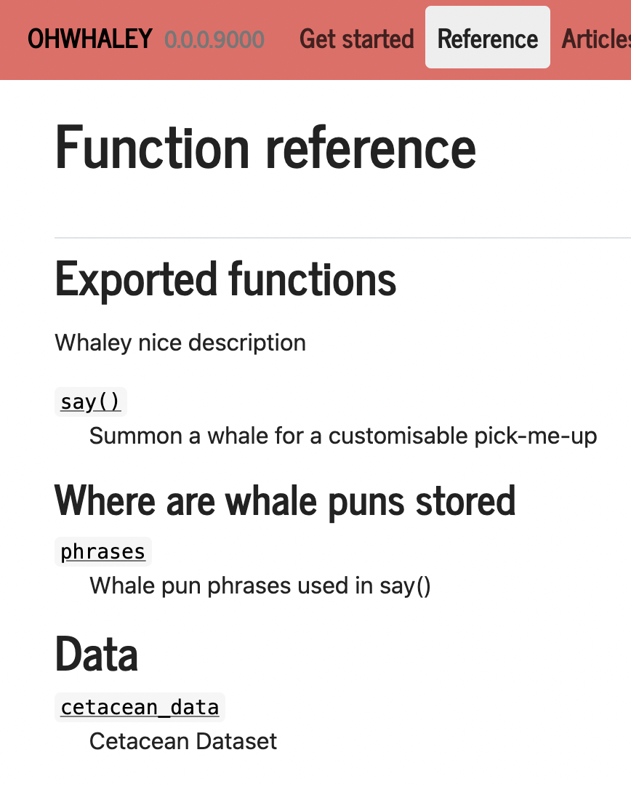
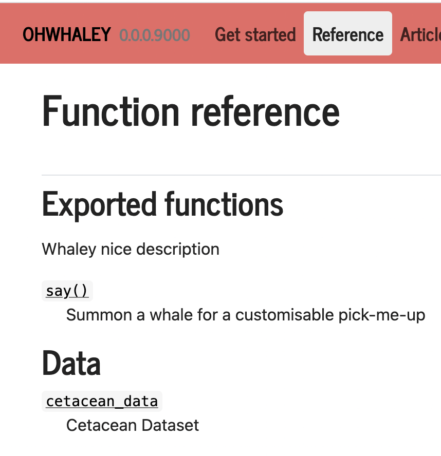

```{r BTS, include=FALSE}
knitr::opts_chunk$set(echo = TRUE,
                      warning = FALSE,
                      message = FALSE,
                      error = FALSE, 
                      eval = FALSE)

pacman::p_load(dplyr)
```


```{r klippy, eval=TRUE, echo=FALSE, include=TRUE}
klippy::klippy(position = c('top', 'right'))
```

In this part of the workshop, we will learn to create and customise a **webpage using `{pkgdown}`** for your R package 📦! We will also implement a GitHub Action to continuous integrate and deploy the website via [GitHub pages](https://pages.github.com/)

We will be using some very handy R tools today! Massive shout out to the contributors and maintainers for of [{usethis}](https://github.com/r-lib/usethis), [{pkgdown}](https://github.com/r-lib/pkgdown) and [r-lib/actions](https://github.com/r-lib/actions/graphs/contributors) for making our lives easier! 👏👏👏

### Hi, have you met pkgdown? 🤝
`{pkgdown}` creates beautiful, static `html` websites for your R package in a few steps. They are straight-forward to configure and  deployed using GitHub pages. If you would like to learn more about `{pkgdown}` I recommend having a good read of the the official [`{pkgdown}` site](https://pkgdown.r-lib.org/articles/pkgdown.html) - made with `{pkgdown}` 😉 Its one I always find myself returning to!

### Let's get started! 🏁 {.tabset}

Before we jump in, we have to make sure the following are installed/set up correctly!:

1. [git](https://git-scm.com/), a version control software
2. your [GitHub Personal Access Token (PAT)](https://docs.github.com/en/authentication/keeping-your-account-and-data-secure/creating-a-personal-access-token), your key to GitHub's API 🔑 

**If you have both these set up, [skip ahead](#jump)** 

If not, click through the tabs below to set these up

#### Check first

First, we can check if we have git and PAT installed/set up correctly. You may have done so in previous projects! Your past self has your back! 🙏

```{r sanity check} 
usethis::git_sitrep()git_sitrep() # git situation report
```

If git and PAT has already been set up, we would see this under the bold heading **GitHub**:


If you don't see this ⚠️ Follow the next tabs to _git sorted_ 😉 

#### Install git

git installation is  via the shell terminal and is OS dependent, so take a look at [this chapter](https://happygitwithr.com/install-git.html#install-git){target="_blank"} of Happy git with R to get started!

#### Create a PAT

I recommend having a good read of `?usethis::gh_token_help()` and follow the instructions there

If you want more details, try the [tl;dr section](https://happygitwithr.com/https-pat.html#tldr){target="_blank"} of the Happy Git and GitHub for the useR book and the subsequent chapters, these will get you on your feet in no time! 

```{r good help and create}
?usethis::gh_token_help()
```

This function will open up a browser for you to select the scopes you want to your PAT to do. The recommended scopes are already pre-selected for ya!

```{r token}
usethis::create_github_token() 
```

If `usethis::create_github_token()` fails, try this link to create a PAT manually on the [GitHub Website](https://github.com/settings/tokens/new?scopes=repo,user,gist,workflow&description=R:GITHUB_PAT){target="_blank"}

#### Saving PAT on your system 

Once you a PAT has been created for you, **copy and save this in your password manager!** For security reasons, you won't get to see the PAT again if you close the browser!  Now we will register your PAT using:

```{r gitset}
# install.packages("gitcreds")
gitcreds::gitcreds_set()
```

Once this is complete, just for peace of mind... check your git settings are OK!

```{r check twice}
usethis::git_sitrep() # git situation report
```

### The best things come as {pkgdown} pages 🎁 {#jump}

Lets go ahead and load the packages we need

If you haven't already, lets load `{devtools}` and `{pkgdown}`

```{r Prep}
# install.packages("devtools", "pkgdown")

library(devtools) #Will load usesthis and roxgen2 as well
library(pkgdown)
```

Like many package dev tools, **`{usethis}`** will assist you in configuring your package so you can build a slick website! To initiate this process, run:

```{r}
use_pkgdown()
```

Notice, how this function does a few things on your behalf:

1. Adds `^_pkgdown\\.yml$`, `^docs$`, `^pkgdown$` to `.Rbuildignore` file
2. Adding 'docs' to `.gitignore` file
3. Creates and open `_pkgdown.yml`. This file controls the overall structure and 'look' of your site

Now try this and **be blown away** 🤯

```{r}
pkgdown::build_site()
```

This function sweeps through all your package and builds `.htmls` for the 3 main sections of your webpage:

1. Homepage (README, Author/Contributors info, GitHub URL, Badges)
2. Reference (A directory of all your functions )
3. Articles (Your vignettes) 

**👀 Note** that if you only have one vignette and it's named as your package name e.g. 'ohwhaley.Rmd', this will automatically be rendered as your 'Getting Started' page

### Storage is a little different 🗃

⚠️ Did you get the warning? 


OK so things in `{pkgdown}` requires a slightly different file organisation! No biggie! Any images e.g hex stickers or plots generated in your documentation, needs to be stored either in `man/figures` or `vignettes/` 

Go ahead and move these files manually in your Files Explorer or Finder 📨

### Set & forget it with GitHub Actions ⏲

So, are you telling me I have to `build_site()` every time I want to make changes to my website?! Thankfully not 😉! 

We can rely on the [`pkgdown` GitHub Action workflow](https://github.com/r-lib/pkgdown) to **continuously integrate the building and deployment** of our website. This is called a **CI/CD** workflow to software devs. You only need to set this up once! 

Give it a try: 
```{r}
use_pkgdown_github_pages()
```

**👀 Note:** This function will ask if you want to **overwrite the existing `_pkgdown.yml`**. This is totally okay since we haven't made any substantial changes to the file, but I would be mindful! Alternatively, you can abort the function, commit your current changes and then proceed to run `use_pkgdown_github_pages` and allow it overwrite your changes

This function does a few things for us with our PAT: 

- it will create/overwrite `_pkgdown.yml`
- create a separate `gh-pages` branch in your repo for deployment. This keeps your repo organised so your `master/main` branch remains R package specific! 
- set up GitHub Pages for you and creating the URL
- place the URL in your `_pkgdown.yml`, `DESCRIPTION`, homepage of your repo
- Saving the `r-lib/actions/examples/pkgdown.yaml@v2` in your workflow folder

**Now commit and push these changes! Navigate to your repo and admire your work!** 🖼

### Updating your package documentation 📝 {.tabset} 

The wonderful thing about `{pkgdown}`, is that it eliminates double handling, you don't need to write seperate files again to build a website! You can **directly make changes to your documentation files and this will automatically update your site!** So what happens if you want to add more functions, or update the contributor lists or want to fix a typo in existing documentation? We can ultimately rely on the GHA we just set up, but often we want to preview changes locally. 

This is when you will become familiar with the [`build_XX()` functions](https://pkgdown.r-lib.org/reference/index.html#build). Let's say that you've fixed a typo in your README, well it is a bit of an overkill to build the entire site to materialise this change? This is when you would use the more targeted `build_home()` function 🎯

These targeted `build_XX()` functions can help streamline a developer's workflow, particularly if they are working on a very comprehensive website with many Articles to render! There is certainly nothing wrong with using `build_site()` as a default (that is what I do for simple packages)!

Below I've provided workflows for updating following files, notice that I've used specific `build_XX()` for each type of documentation changes:

#### DESCRIPTION (Authors/URLs)

1.  Add/Edit your `DESCRIPTION` file
2. `usethis::document()`
3. `pkgdown::build_home()`  

#### README

1. Add/Edit your `README` - **Note** if you are using a `README.Rmd`, remember to knit to regenerate its fellow `README.md` 
2. `usethis::document()`
3. `pkgdown::build_home()`

#### Functions (roxygen2)

1. Add .Rmds in your `vignettes/` directory using `usethis::
2. `usethis::document()`
3. `pkgdown::build_reference()`

#### Vignette
1. Add/Edit your vignette(s)
2. Knit to see if you like your changes
3. `usethis::document()`
4. `usethis::build_vignettes()`
5. `pkgdown::build_articles()`

### Got Articles? 📚

So what if you want more Articles on your site for case studies, walk-throughs but don't want to necessarily exported these as vignettes with your R package?  

We can use: 

```{r}
usethis::use_article() 
```

Similar to `usethis::vignette()`, this will create a .Rmd and store it in `vignettes/articles/`. Once you are done editing the .Rmd, use `build_articles()` to preview your work!

Now to the fun stuff! ⏭

### Customising your website ✨🎨 

Similar to a `ggplot`, you can tweak *almost* anything on your `{pkgdown}` webpage. Below, I will go through a few simple features to achieve a polished looking site. If you require more specific styling, I recommend [this documentation on the {pkgdown} site](https://pkgdown.r-lib.org/articles/customise.html).

#### Boot-itful themes 🦄

The most efficient way to style your pkgdown site is to use Bootswatch themes. You can preview these theme here: https://bootswatch.com/

Once you have selected one you like, you can assign the name of the theme as the `bootswatch` parameter in your `_pkgdown.yml` 

```yaml
url: https://fontikar.github.io/ohwhaley/
template:
  bootstrap: 5
  bootswatch: journal
```

I am going to go for the `Journal` theme! I like the look of the pink! 

<center>

{width=50%}

</center>

Now you quickly preview these changes without building the whole site by using: 

```{r}
build_home_index()

preview_site() # Opens new browser with recent changes
```

`build_home_index()` runs faster than `build_home` as it ONLY builds the `index.html` homepage. This will skip the building  the `authors` + `LICENSE` htmls which is handy if you want to quickly preview your changes. 

Hang on...why is my page not like the example in the preview? Why is my navbar...not pink?! (There are times I've tested this and it was BLUE!?)


Well generally, each Bootswatch theme has three background (`bg`) variations: `light`, `dark` and `primary` and two foreground (`type`) variations: `light` and `dark`

`{pkgdown}` will attempt to choose the correct colours for `bg` and `type` according to the preview but sometimes this doesn't match. We can override the default navbar colour palette by changing the values for `bg` and `type` as below:

```yaml
url: https://fontikar.github.io/ohwhaley/
template:
  bootstrap: 5
  bootswatch: journal
navbar:
  bg: primary
  type: light
```

Repeat the build process for the home page but this time use `init_site()`. This implements your recent changes but doesn't open a new tab. To view your changes, hit `Refresh` or Ctrl/Cmd+R - ta-da! 🎉

```{r}
build_home_index()

init_site() # Implements changes
```

⚠️🐛 When I tested this section on a mac M1 machine and attempted to override the default colours of the Journal theme....it turned blue! I end up switching the theme entirely to something else e.g. `theme: cosmo` and built the site and made sure it changed. After that, I reverted back to `theme: journal` and set the `bg: primary` and `type: light` and it seemed to work again! Just flagging here in case it is consistent across the workshop!

### Nifty Navbars 🗺

What if we want to add more features or change the order of our navbar items? We can **control the layout of our navbar** items using the `structure` field within the `navbar` controls in your `_pkgdown.yml`

Currently the default layout of all pkgdown sites is:

```yaml
navbar:
  structure:
    left:  [intro, reference, articles]
    right: [search, github]
```

**Lets try moving the GitHub icon to the left!**

You can add additional items such as:

- [News](https://pkgdown.r-lib.org/reference/build_news.html) section to showcase recent changes to your package (e.g. bug fixes, new features)
- [Tutorial section](https://pkgdown.r-lib.org/reference/build_tutorials.html) for embedding [`learnr` tutorials](https://rstudio.github.io/learnr/).  These can be stored in `inst/tutorials` or `vignettes/tutorials` 

For example:
```yaml
navbar:
  structure:
    left:  [intro, reference, articles, tutorials, news]
    right: [search, github]
```

You can alter the **content of each navbar section** using the `component` field. For example, if you have multiple articles like the [{tidyverse::dplyr} site](https://dplyr.tidyverse.org/), you can create subheaders or section separators in the dropdown menu to better organise your `Articles` section like so:

```yaml
navbar:
 components:
   articles:
    text: Articles
    menu:
    - text: "Menu sub-heading"
    - text: Article name A1
      href: 'articles/a1.html'
    - text: Article name A2
      href: articles/a2.html
    - text: -------
    - text: "Another menu subheading"
    - text: Article name B1
      href: articles/b1.html
```


You can also edit your [sidebar](https://pkgdown.r-lib.org/articles/customise.html#sidebar) and [footer](https://pkgdown.r-lib.org/articles/customise.html#footer) from the current default st, though I rarely deviate from the defaults. The process is similar as the navbar example above! Learn more here at the [{pkgdown} customising your site article](https://pkgdown.r-lib.org/articles/customise.html)

### Ordering your Reference Section 🗂

For larger, more complex packages that have many functions, it is often useful to group our functions in a logical, tidy way for the Reference section. For example, take a look at the [{pkgdown} reference section](https://pkgdown.r-lib.org/reference/index.html). 

We can tweak the Reference using the `reference` field in the `_pkgdown.yml`

You can add a `title` or `subtitle` to divide your functions and provide it with an information using the `desc` field (description). 

Here is an [example from the `{ohwhaley}`](https://github.com/fontikar/ohwhaley/blob/pkg/_pkgdown.yml) package so you can see what field corresponds to what outcome:

```yaml
  navbar:
reference:
- title: Exported functions
  desc:  Whaley nice description
- contents:
  - say
- subtitle: Where are whale puns stored
- contents:
  - phrases
- title: Data
- contents:
  - cetacean_data
```
<center>

{width=50%}

</center>

**👀 Note:** I've included the `navbar:` field so you see how the indents need to be formatted relative to the other fields! 

#### Tidy content selection

There are few handy functions teo help you select functions that share the same prefix or suffix: 

- `starts_with("prefix")` to select these shared prefixes 
e.g. `join_all`, `join_with`, `join_by` 
- `ends_with("suffix")` for shared suffixes 
e.g. `make_data`, `change_data`, `bind_data`

#### Hide internal functions

Have some utility functions that you don't want to share in your Reference section? No probs! Pop these using a section with the `title` field set to `internal`. 

**👀 Note** that there is **NO `-`** in front of the **contents** field

```yaml
  navbar:
reference:
- title: internal
  contents:
  - phrases
```
<center>

{width=50%}

</center>